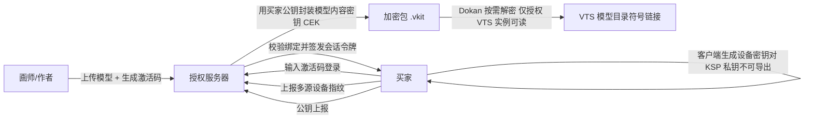

# 更强 VTS 模型锁：调研结论与推荐方案

> 目标：让模型作者给 VTS（VTube Studio）分发 Live2D 模型时，要求买家输入激活码才能使用，且做到“一人一码、不能串用”，并尽可能提高绕过成本。
> 本文基于对 ProjectVFS、VTSResourceHook、XFD（小fa模型锁）分析文档、VVON-Model、Live2DViewerEx LPK 解包器等公开资料的源码/二进制/文档调研整理。

---

## 0. 一句话结论

**有更安全的实现方式，而且已经有可参考的工程范例。**

推荐架构 = **在线激活码授权（账号 + 多源设备指纹绑定）** × **每买家密码学绑定（RSA/ECDH 封装内容密钥，包离开目标设备就解不开）** × **Dokan 虚拟盘按需解密（明文不落盘）** × **进程级访问控制 + 客户端加固 + 读取预算 + 逐买家水印**。

其中“包绑定到唯一设备/账户”是防串用的核心，比“激活码 + HWID 哈希”更强：激活码是共享秘密，转发就能复用；而“用买家公钥封装内容密钥”是密码学绑定，转发 `.vkit`/`.enc` 给第二个人也解不开。

---

## 1. 调研证据：现有方案为什么不够安全

### 1.1 ProjectVFS（作者开源的文件层锁）

源码确认的机制：

- Dokan 内存虚拟盘，`read_file` 回调里做 PID 白名单，不在名单返回 `STATUS_ACCESS_DENIED`；
- `.png` 同一打开句柄只允许读一次（`has_been_read`）；
- VFSX 流水线：`EncPack.exe decrypt .enc --key <32字符>` → 解到临时目录 → 移入 `X:\` → `LinkArc.exe` 按 `file_mapping.json` 生成符号链接目录给 VTS。

弱点（实测证据见 VTSResourceHook）：

- **只有 `read_file` 检查 PID**：目录枚举、创建、写入都不查，文件名本身可被非授权进程列出；
- **PID 可被“同进程内代码”冒充**：注入 VTS 后所有 I/O 都来自被信任的 PID；
- **PNG 限读按句柄**：重新打开即可再读；
- **加密工具（EncPack/LinkArc）闭源**，密钥格式未知，但 32 字符密钥作为“激活码”本质是共享秘密。

### 1.2 XFD / 小fa模型锁（商业锁）

仓库内 `XFD-Architecture-Analysis.md` 与其被逆向的补丁（`VTSResourceHook.XFD.exe` 内嵌的 `hwid-shim.cjs`）显示：

- 授权：激活码/账号登录 → 多源 HWID（MachineGuid、硬盘序列号、CPU ProcessorId、MAC、BIOS/主板序列号、卷序列号、主机名）→ 服务端绑定 `账号 ↔ 设备` → 心跳 → `FORBIDDEN` 封禁；
- 检测：MD5 黑名单（`tasklist`/WMI + `md5-file`）、`ApiHookCheck.dll` 原生 Hook 扫描、chokidar 文件监控、`taskkill`、常驻服务 `VtsSecureService`；
- 文件层：`model-mfs.exe`（Dokan 客户端）+ PID 白名单。

实际绕过（来自同一个补丁源码）：

- 每次启动伪造一套内部一致的合成设备身份（GUID/CPU/硬盘/MAC/主机名），并 hook `os`、`child_process`、`node-machine-id`、`node-wmi`、Electron IPC 全部指纹通道 → 服务端每次看到的都是一台“新设备”，黑名单失效；
- 对 `ipc:query-drive-info`、`ipc:query-dokan2-info`、`ipc:query-vts-info`、`ipc:vts:fingerprint` 等通道做深度字段替换；
- 通过 `koffi` / `.node` / `process.dlopen` 三层拦截，把 `ApiHookCheck`/`ahc.dll` 等反注入 DLL 替换成恒返回“干净”的 no-op；
- fs 层“蒙眼”让检测扫描永远找不到工具文件，并抑制检测弹窗与 `app.quit`；
- 在 XFD 主进程内跑 VTS 看门狗，发现 `VTube Studio.exe` 后等 10 秒（Mono 初始化）再注入导出。

结论：**“HWID 哈希绑定 + 客户端检测”这类方案在攻击者能改客户端时整体失效**，因为指纹采集和校验都在客户端。

### 1.3 Live2DViewerEx 的 LPK 加密（反面教材）

`game-gpt/live2d`（lpk-unpack）解包器源码显示 LPK 加密被破的根因：

- 包是普通 ZIP，加密标志和 `config.mlve`/`config.json` **明文存在包内**；
- 密钥 = `mlve_config.id + filename`（或 `id + file_id + meta_data + filename`），全部从包内可读配置推导；
- 即“加密”的密钥材料随包分发且可推导 → 任何人拿到包都能解。

教训：**密钥绝不能存在包内或能从包内数据推导出来**。这是“更安全”设计的第一条铁律。

### 1.4 VVON-Model（当前公开最强的离线方案）

`Ayanamiel/Software-Testing`（VVON-Model v2.8）是目前找到的最接近“理想形态”的工程实现：

- 买家客户端（C++20/Win32/Dokany）首次运行在 Windows CNG/KSP 生成 **RSA-2048 密钥对，私钥不可导出**，且绑定当前 Windows 用户账户；
- 买家导出 `.vreq`（只有公钥）→ 画师端校验（canonical SPKI、RSA-2048、e=65537、key ID）→ 随机生成内容密钥 CEK → **用买家公钥 RSA-OAEP 封装 CEK** → 产出 `.vkit`；
- 客户端用 KSP 私钥解出 CEK，Dokan 按 2 MiB 块**按需解密**，明文只进内存缓存（上限 32 MB），不落盘；
- 挂载点在 `VTube Studio_Data\StreamingAssets\Live2DModels\<包名>`；**打开阶段就校验**“进程 ID + 持有进程句柄”（防 PID 复用冒充），非授权进程连目录句柄都拿不到；
- 客户端亲手拉起 VTS（Job 对象管理），卸载/关闭客户端 = 强杀 VTS；
- 读取预算：单文件重读抑制（块数 × 8）＋整卷输出熔断（受保护内容总量 × 3），防“反复扫包榨干内容”；
- 客户端加固：ASLR / ImageLoad / DynamicCode / StrictHandle / ExtensionPoint / DllSearch 进程缓解、自签名完整性校验（固定证书指纹）、Dokan 组件校验、xorstr 字符串混淆；
- 逆向工具预检 + 运行期监控（RenderDoc / Cheat Engine / NinjaRipper，12 秒轮询，命中即整卷卸载）；
- 完全离线：无服务器、无遥测。

VVON 的局限：

- **无在线吊销/封禁能力**：包一旦发出，作者无法远程作废；
- **换机/重装 = 包失效**，需要重新打包（这是“不可导出私钥”的代价）；
- 作者自己承认：本地 DRM 挡不住“完全控制本机”的攻击者，目标是抬高门槛。

---

## 2. 推荐架构（混合方案：在线激活码 × 离线密码学绑定）



三层职责：

1. **授权层（在线）**：激活码 = 一次性凭证；服务端维护 `激活码 → 账号 → 设备(多源指纹) → 设备公钥` 绑定；每次使用前在线校验，支持吊销、封禁、换机审批。
2. **文件层（离线密码学）**：模型用随机 CEK 加密（AEAD，如 AES-256-GCM / XChaCha20-Poly1305）；CEK 用买家设备公钥封装进包；**包外任何设备都解不出 CEK**。
3. **访问层（本地）**：Dokan 挂载 + 符号链接接入 VTS；打开/读全链路做“PID + 进程句柄”双重校验；明文只存在于进程内存，按块解密、用完可清。

### 2.1 为什么这个组合满足“一人一码不能串用”

- **码不能串**：激活码首次绑定即作废/限量；同码换设备会被服务端指纹比对拦住；
- **包不能转**：`.vkit` 的内容密钥是“加密给买家公钥”的，转发给任何人都解不开（即使他也有激活码，除非作者/服务器为该设备重新签发）；
- **复制不能跑**：即使有人从买家机器拷走解密后的文件，也失去了“只有授权 VTS 能读 + 读取预算 + 水印”等防护，作者还能通过水印溯源。

---

## 3. 关键设计细节

### 3.1 设备身份与密钥

- 客户端（C++/Rust，原生实现，**不用 Electron**）首次运行：
  - 用 CNG 生成 RSA-2048（或 P-256 ECDH）密钥对，私钥 `NCRYPT_PROTECT_TO_SYSTEM` 或绑定用户账户存入 KSP，`NCryptSetProperty` 禁止导出；
  - 可选增强：用 TPM 2.0 密封私钥（DPAPI-NG / NGC），重装系统后自动失效（防迁移，作者可控“换机重新授权”）。
- 多源设备指纹仅用于服务端风控（不是加密边界）：MachineGuid + 硬盘序列号 + CPU ProcessorId + MAC + 卷序列号，服务端做“同一硬盘序列号出现在两个身份”的共谋检测。

### 3.2 加密包格式（`.vkit` v1 建议）

```text
┌───────────────┬──────────────────────────────────────────────┐
│ 包头          │ magic "VKIT" / 版本 / 模型ID / 作者ID          │
├───────────────┼──────────────────────────────────────────────┤
│ 接收者清单    │ 1..N 个 { 接收者keyID, RSA-OAEP(CEK), 签名 }    │
│               │ （单人版只含买家 1 个接收者）                    │
├───────────────┼──────────────────────────────────────────────┤
│ 文件表        │ 路径(允许字符表) / 长度 / 块偏移 / 每块AEAD标签  │
├───────────────┼──────────────────────────────────────────────┤
│ 内容区        │ 分块密文（每块独立 nonce + 关联数据=路径+块号） │
└───────────────┴──────────────────────────────────────────────┘
```

- 分块大小 1–2 MiB，块独立认证 → 支持按需解密 + 随机读；
- 包签名：作者私钥对包头签名，客户端可验“包确实来自该作者”；
- 每个买家一个接收者条目 → **同一个模型可以“一次打包、多人各一把钥匙”**（比 VVON 的逐人打包更方便，同时保留密码学绑定）。

### 3.3 VTS 接入

- VTS 官方插件 API 只能加载“已经存在于模型目录”的模型，没有注入加密资源的官方通道（已核对 DenchiSoft/VTubeStudio API 文档）→ **Dokan 虚拟盘 + `StreamingAssets\Live2DModels\<name>` 符号链接是唯一现实接入点**；
- 客户端亲自启动 VTS（`-nosteam`），用 Job 对象管理；卸载即杀，不留解密态；
- 身份校验：`GetProcessId(handle)` 拿到 PID 后还要持有进程句柄并周期性复核，防止 PID 复用/伪造；打开与读都拒绝非授权进程（含目录枚举）。

### 3.4 读取预算（防“榨干”）

- 单文件：每文件允许读取 = 块数 × K（K≈8），超限后本会话内 `STATUS_DATA_ERROR`；
- 整卷：受保护内容总量 × 3 熔断，超限整卷 `ACCESS_DENIED` 并 sticky 锁死，只能卸载重挂（卸载 = 杀 VTS）；
- 预算按挂载会话重置，不累积。

### 3.5 客户端加固清单

- 原生语言（C++/Rust），避免 Electron/JS 被整体 hook（XFD 就是这么被拆的）；
- 代码签名 + 启动自校验（固定证书指纹 + 文件哈希），Dokan 组件同样校验；
- Windows 进程缓解：`ProcessMitigationPolicy` 启用 ASLR、ImageLoad、DynamicCode（禁止运行时生成可执行代码）、StrictHandle、ExtensionPoint、DllSearch=System32；
- 关键字符串 xorstr 混淆；反调试/反注入为可选增强（注意误伤）；
- 逆向工具预检 + 运行期轮询（RenderDoc / Cheat Engine / NinjaRipper 等），命中即自动卸载；
- 日志脱敏：不记密钥、CEK、派生密钥、完整模型路径。

### 3.6 服务端（可选但推荐，补 VVON 短板）

- 端点：激活码兑换、设备注册、令牌签发、模型授权校验、心跳、吊销/封禁、换机审批；
- 会话令牌短时有效（如 12–24h），心跳续期；断网宽限（如 3 天）后可配置；
- 服务端只存公钥、指纹哈希、授权状态；**不落 CEK/私钥**；
- 风控：同硬盘序列号多身份、同 IP 多码、激活码使用次数、异常时 `FORBIDDEN`；
- 若完全不想建服务器：采用 VVON 纯离线模式（公钥交换 + 作者台账），但接受“无法远程吊销”。

### 3.7 逐买家水印（溯源）

- 打包时为每个买家在贴图/JSON 中嵌入不可见唯一标识（如贴图最低位平面微扰动 + `.model3.json` 冗余字段指纹）；
- 泄露后能定位到具体买家，形成威慑。

---

## 4. 安全边界（必须诚实）

1. **本地 DRM 的天花板**：模型必须被渲染 → 内存/显存中必有明文 → 完全控制本机的攻击者理论上总能提取（VVON 作者也明说）。任何“绝对防提取”的宣传都是假的。
2. 本方案的目标：防“随手拷走”“扒包工具”“转发第三方”“共享激活码”，并让专业提取成本高到不划算、且可溯源。
3. 不要重蹈覆辙：
   - 密钥不能随包明文或从包内数据推导（LPK 教训）；
   - 不能只靠 PID 白名单（进程内注入教训）；
   - 不能只靠客户端 HWID（客户端可整体伪造教训）；
   - 不能只靠黑名单/检测（重打包即绕过教训）。

---

## 5. 实施路线

| 阶段 | 内容 | 技术栈 | 参考 |
|---|---|---|---|
| P0 MVP | 激活码 + 服务端绑定 + 每设备 RSA 封装 CEK + Dokan 按需解密 + VTS 符号链接挂载 | Rust/C++ + Dokan2 + CNG + 简单后端（Go/Node） | ProjectVFS（壳）+ VVON（密钥设计） |
| P1 加固 | 进程缓解、签名自校验、VTS 实例管理（Job 杀进程）、读取预算、逆向工具监控 | Win32 API + 少量汇编层加固 | VVON 客户端 |
| P2 在线增强 | 心跳、吊销/封禁、换机审批、风控、短时令牌 | 后端 + 客户端 | XFD 授权层（反向借鉴其弱点） |
| P3 溯源 | 逐买家水印 + 泄露分析工具 | 图像处理（PNG 最低位平面） | 自研 |
| P4 可选硬件 | TPM 密封私钥、VBS/HVCI 兼容性验证 | CNG/DPAPI-NG | Windows 文档 |

建议直接复用/改造两个开源基础：ProjectVFS 的 Dokan 层（MIT 生态）与 VVON 的加密设计思路（闭源但协议已公开描述）。核心工作量在客户端原生实现与后端，预计 MVP 1–2 周可出可跑版本。

---

## 5.1 VTS 实例如何拉起（Steam 认证问题的答案）

调研结论（依据 VTube Studio 官方 wiki 的 “Starting without Steam” 页面）：

1. **VTS 只通过 Steam 分发，但下载后可以不经过 Steam 启动**：官方自带 `start_without_steam.bat`，实际就是直接运行 `VTube Studio.exe -nosteam`（VVON 客户端文档也确认该参数）。
2. **免 Steam 启动的代价**：VNet 多人功能不可用；其余（模型加载、webcam/手机追踪、插件 API）正常。“去水印” DLC 需要至少用 Steam 启动一次，之后该电脑上离线也可用。
3. 因此锁客户端采用：**先挂载 Dokan 卷（VTS 模型目录），再通过 Steam 启动 VTS**（`steam.exe -applaunch 1325860`）。VTS 启动扫描 `StreamingAssets\Live2DModels` 时就能看到挂载的模型目录。
4. **Steam 启动强制校验（已实现）**：客户端先快照现有 VTS PID 集合，触发 Steam 启动后轮询监听**新出现**的 `VTube Studio.exe` 进程；只有**父进程映像为 steam.exe** 的新实例才会被授权（`parent_is_steam`，排除手动双击与 `-nosteam` 直启）。已存在的旧实例一律不授权。`--launch-mode nosteam` 仅保留给开发调试。
5. **进程身份与回收**：
   - 客户端 `CREATE_SUSPENDED` 创建进程 → 分配 Job（`JOB_OBJECT_LIMIT_KILL_ON_JOB_CLOSE`）→ `ResumeThread`；关闭 Job 句柄即杀整棵进程树（卸载必杀 VTS，不留解密态）。
   - 授权判据 = **PID + 持有的进程句柄**：每次 I/O 校验请求 PID 等于已授权 PID，且 `GetProcessId(已持有句柄) == PID`。VTS 退出后句柄失效，PID 被系统复用时无法冒充。
6. **权限注意事项**：若 VTS 被设置为“以管理员运行”，非管理员客户端无法直接 CreateProcess（错误 740），需要提权 helper 或要求客户端以管理员运行；Job 与 VTS 必须在同一完整性级别。

## 5.2 离线验证（无云服务器）可选方案

现状：客户端 `mount` 依赖服务器（`/api/status`、`/api/refresh`），`activate` 依赖服务器发码绑定；`.vkit` 本身已经是"按买家公钥封装 CEK"的密码学绑定，打包器已支持作者签名（`author_signature`），但 Rust 客户端尚未校验作者签名。

### 方案 A：纯"包即许可"（VVON 路线，改动最小）

- 流程：买家 `init` 导出 `.vreq` → 画师打包（按买家公钥封装 CEK）→ 买家 `mount` 直接可用。
- 客户端改动：去掉 `ensure_valid_token`/`activate` 的服务器调用；`mount` 打开 `.vkit` → 解 CEK → 挂载。
- "一人一码"含义：激活码退化为画师台账里的订单标识；密码学上每个包只对一把钥匙可解，转发无效。
- 优点：零基础设施、断网可用、改动最小。缺点：无远程吊销/封禁；换机/重装需重新打包；无"输码"体验。

### 方案 B：离线激活码 + 签名许可（推荐，保留输码体验）

- 画师侧：生成随机激活码，登记到本地 SQLite 台账（绑定买家 `key_id`）；打包时把"许可声明"写入 `.vkit` header 或独立 `.license` 文件：
  `{model_id, key_id, code_hash, expires_at?, 备注}`，用画师私钥签名（复用现有 `author_signature` 机制）。
- 客户端侧：
  1. 首次信任画师公钥（内置或 `trust-author` 导入）；
  2. `mount` 时校验：作者签名有效 → 许可中 `key_id` == 本机设备 `key_id` → 激活码哈希匹配（首次输入，之后本地保存）→ 可选过期时间；
  3. 解 CEK → 挂载。
- 一人一码：码与 `key_id` 绑定，而 `.vkit` 只对绑定钥匙可解，码无法转借。
- 优点：保留激活码 UX；作者签名防伪；完全离线；可加限时。缺点：仍无远程吊销；客户端需信任画师公钥。

### 方案 C：离线限时许可（租用/订阅）

- 在 B 基础上许可带 `expires_at`；客户端用本地时钟 + 上次运行记录校验（可被改系统时间绕过，建议配合 TPM/系统时间源或仅作低强度限制）。

### 方案 D：离线为主 + 可选吊销列表

- 默认走 B；画师后续发布"吊销列表"（签名文件），用户手动导入后客户端拒绝对应 `key_id`/码。服务器变成完全可选的同步通道。

### 推荐：方案 B

理由：产品体验（输码）保留；复用现有 recipient 封装与作者签名；"一人一码"依然成立；改动量可控（packager 增加发码与许可签名，client 增加作者签名校验与许可校验，删除服务器调用）。

实现清单（方案 B）：
1. packager：`gen-code`（随机码 + SQLite 台账）、`pack --code`（把许可声明签名进 header/输出 .license）；
2. client：内置/导入画师公钥（`trust-author`）；`vkit.rs` 增加 `verify_author`（RSASSA-PSS）；`mount` 增加许可校验（码输入/本地缓存）；移除服务器依赖；
3. 可选：吊销列表导入、限时许可。

## 6. 主要参考来源

- `BarryWangQwQ/ProjectVFS`：VFS/VFSX/VFSXGUI Rust 源码
- `BarryWangQwQ/VTSResourceHook`：README、XFD-Architecture-Analysis.md、两个 exe 的字符串与内嵌 `hwid-shim.cjs`
- `Ayanamiel/Software-Testing`：VVON-Model README、客户端/画师端说明书
- `game-gpt/live2d`：LPK 解包器源码（密钥从包内配置推导）
- `DenchiSoft/VTubeStudio`：官方插件 API 文档（模型加载仅支持已存在目录）

